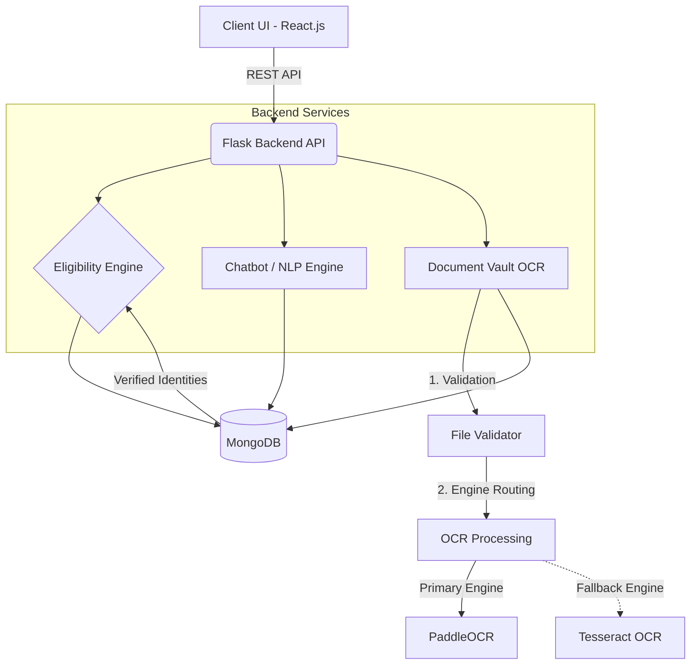
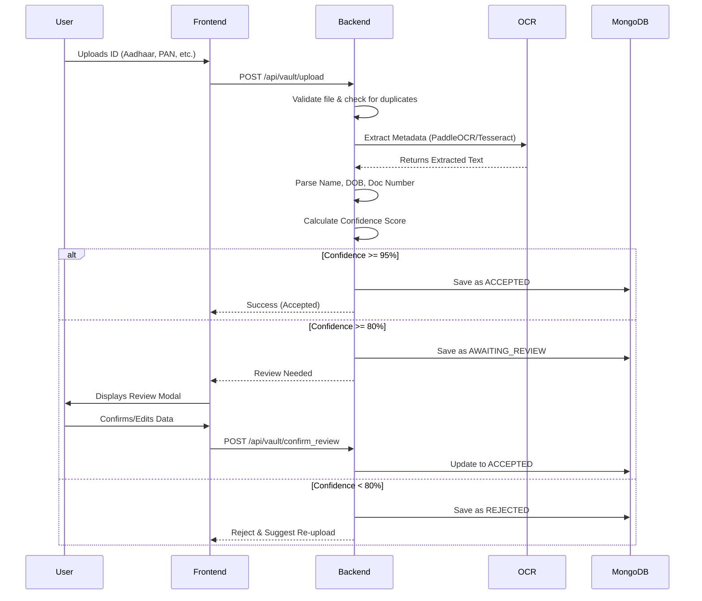

# SATYA - Multilingual AI-Based System for Government Scheme Eligibility

**SATYA** (System for AI-based Transparency and Yielding Assistance) is an intelligent web-based platform designed to bridge the awareness gap surrounding government schemes in India. It enables users to discover eligible welfare schemes through a rule-based engine and a powerful, multilingual AI chatbot, backed by a fully automated Document Vault for secure identity verification.

---

## 🚀 Recent Updates

- **Document Vault**: Streamlined verification flow by bypassing legacy OTP requirements, refined the extraction preview UI, and simplified the review interface by omitting redundant fields.
- **Chatbot Interface**: Improved chat persistence mechanisms (domain selection, clear chat functionality), modernized UI by removing obsolete elements, and polished visual indicators.

---

## 🏗️ Project Architecture



---

## 🛠️ Technology Stack

### Frontend
- **React.js** (Vite)
- **i18next** for real-time 9-language localization
- **Lucide React** for premium iconography
- **Framer Motion** for micro-animations and smooth UI transitions
- **Vanilla CSS** with a custom design system & glassmorphic layouts

### Backend
- **Python Flask** REST API
- **PaddleOCR** & **Tesseract** for intelligent document extraction
- **PyMuPDF / pdf2image** for handling digital and scanned PDFs
- **MongoDB** for scheme, FAQ data, and document vault metadata
- **GoogleTrans** & **LangDetect** for real-time translation logic
- **JWT & bcrypt** for secure user authentication

---

## 📂 Folder Structure

```
SATYA/
├── frontend/                   # React application
│   ├── src/
│   │   ├── components/         # UI Components (Navbar, Chatbot, DocumentCard, ReviewModal)
│   │   ├── pages/              # Main App Pages (Eligibility, Vault, Diagnostics)
│   │   ├── i18n.js             # Localization Config
│   │   └── index.css           # Design System & Tokens
├── backend/                    # Flask API
│   ├── routes/                 # API Endpoints (auth, chatbot, schemes, vault)
│   ├── vault/                  # Document Processing Engine
│   │   ├── verifiers/          # Specific logic for Aadhaar, PAN, Passport, etc.
│   │   ├── ocr_utils.py        # Central OCR engine (PaddleOCR + Tesseract fallback)
│   │   └── security.py         # Duplicate detection & payload sealing
│   ├── data/                   # Persistent JSON & Cache
│   ├── database.py             # MongoDB Connection
│   └── app.py                  # Entry Point
├── uploads/                    # Secure local vault storage
└── README.md
```

---

## 🔍 OCR Pipeline

The OCR pipeline in the **Document Vault** operates through a highly resilient, multi-stage process to extract user identity details:

1. **Upload & Validation**: Validates file types (JPG, JPEG, PNG, PDF), enforces file size limits, and securely saves the file.
2. **Preprocessing**: PDFs are automatically converted into optimal image formats. Images are resized and normalized for maximum OCR accuracy.
3. **Primary Extraction (PaddleOCR)**: The primary, high-accuracy deep learning OCR engine runs.
4. **Fallback Extraction (Tesseract)**: If PaddleOCR returns no text or low confidence, Tesseract OCR triggers automatically.
5. **Entity Recognition**: Uses document-specific regex parsers (e.g., Aadhaar vs PAN) to cleanly extract `Name`, `DOB`, `Gender`, and `Document Number`.
6. **Confidence Scoring**: Heuristic confidence is calculated based on which vital fields were found and how cleanly they matched the templates.

---

## 📄 Document Processing Workflow



---

## 🎯 Eligibility Workflow

The Eligibility Workflow uses the **Document Vault** to securely vet users before determining their eligibility for government schemes:

1. **Identity Gate**: When a user accesses the eligibility engine, it checks if the user has verified their identity through the Document Vault.
2. **Verified Match**: If the user submits personal details (Name, DOB, State), the backend dynamically compares these against the `sealed_payload` of their accepted documents.
3. **Match Breakdown**: If there is a mismatch (e.g., a spelling difference in the name or mismatched DOB), the engine surfaces a detailed **Identity Match Breakdown**, showing exactly which fields failed the threshold check.
4. **Scheme Processing**: If the identity is verified, the rules-engine cross-references their attributes (Age, Income, Caste, Gender, State) against the database of government schemes and returns customized results.

---

## 🔌 API Endpoints List

### Authentication
- `POST /api/auth/register` - Create a new user
- `POST /api/auth/login` - Authenticate user

### Scheme Engine
- `POST /api/schemes/eligible` - Calculate eligible schemes based on profile
- `GET /api/schemes/categories` - Fetch scheme categories
- `GET /api/schemes/` - Fetch all schemes

### Chatbot
- `POST /api/chatbot/message` - Send query and get multilingual NLP response
- `GET /api/chatbot/suggestions` - Get suggested chat questions

### Document Vault
- `POST /api/vault/upload` - Securely upload and run OCR on a document
- `POST /api/vault/confirm_review` - Approve or correct an `AWAITING_REVIEW` document
- `GET /api/vault/` - Get all documents for a user
- `DELETE /api/vault/<doc_id>` - Delete a document and its resources
- `GET /api/vault/identity` - Check combined verification status
- `GET /api/vault/analytics` - Fetch processing times, engine usage, and success rates
- `GET /api/vault/health` - Check OCR engine status

---

## 🗄️ Database Schema (MongoDB)

### Users Collection
- `_id`, `email`, `password`, `name`, `created_at`

### Schemes Collection
- `_id`, `name`, `description`, `category`, `benefits`, `eligibility_criteria` (Age, Income, Gender, Caste, State)

### Vault Documents Collection
- `user_id`: Reference to user
- `filename`, `file_path`, `document_type`, `upload_date`
- `verification_status`: Enum (`Processing`, `Accepted`, `Awaiting Review`, `Rejected`)
- `sealed_payload`: Immutable object containing the final verified Name, DOB, Gender, and ID Number.
- `ocr_metadata`: Internal tracking (Engine used, processing time, confidence score).

---

## ⚙️ Installation Steps

### Prerequisites
- Node.js (v18+)
- Python (v3.10+)
- MongoDB (Running on `localhost:27017`)
- PaddlePaddle/PaddleOCR dependencies (C++ Build Tools for Windows)

### 1. Backend Setup
```bash
cd backend
python -m venv venv
# Windows:
.\venv\Scripts\activate
# Mac/Linux:
source venv/bin/activate

# Install dependencies (may take time for PaddleOCR)
pip install -r requirements.txt

# Seed the database
python seed.py

# Start the Flask Server on port 5000
python app.py
```

### 2. Frontend Setup
```bash
cd frontend
npm install
npm run dev
```
*Access the platform at `http://localhost:5173`.*

---

## 📸 Screenshots
*(To be added: DocumentVault Dashboard, Review Modal, Diagnostics Page, and Scheme Matcher)*

---

## ⚠️ Known Limitations
- **PDF Processing Overhead**: Scanned PDFs are memory intensive as they must be rasterized to images before OCR processing. Processing times for large PDFs scale linearly per page.
- **PaddleOCR Cold Start**: On the very first upload, PaddleOCR lazily loads its neural network models into memory, causing the first document to take an additional ~1.5s to process.
- **Hardware Dependency**: Without a CUDA-compatible GPU, PaddleOCR defaults to CPU processing which is noticeably slower on older machines.

---

## 🛡️ License
This project is for educational and research purposes under the SATYA initiative.
